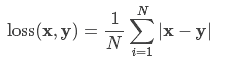
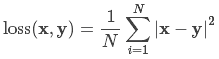

# [pytorch_tutorial](https://juejin.im/post/5bcd3e00e51d457a203cd9b2)

#### [Beginner](beginner_tutorials)

#### [intermediate](./intermediate_tutorials)

#### [advanced](advanced_tutorials)


#### [损失函数](http://pytorch-cn.readthedocs.io/zh/latest/package_references/torch-nn/#distance-functions)

* nn.L1Loss </br>
预测值和真实值的绝对误差的平均数即可.</br>

* nn.MSELoss</br>



[contiguous](https://zhuanlan.zhihu.com/p/64551412)
---

contiguous 本身是形容词，表示连续的，关于 contiguous,
PyTorch 提供了is_contiguous、contiguous(形容词动用)两个方法,
分别用于判定Tensor是否是 contiguous 的，以及保证Tensor是contiguous的.

is_contiguous直观的解释是**Tensor底层一维数组元素的存储顺序与Tensor按行优先一维展开的元素顺序是否一致**。

Tensor多维数组底层实现是使用一块连续内存的1维数组（行优先顺序存储).
(如transpose、permute、narrow、expand)与原Tensor是共享内存中的数据，
不会改变底层数组的存储，但原来在语义上相邻、内存里也相邻的元素在执行这样的操作后，
在语义上相邻，但在内存不相邻，即不连续了(is not contiguous).

### 为什么需要 contiguous ？
* torch.view等方法操作需要连续的Tensor.
``` bash
transpose,permute 操作虽然没有修改底层一维数组，
但是新建了一份Tensor元信息，并在新的元信息中的 重新指定 
stride。torch.view 方法约定了不修改数组本身，只是使用新的
形状查看数据。如果我们在 transpose、permute 操作后执行 view.

t = torch.arange(12).reshape(3,4)
>>>t
tensor([[ 0,  1,  2,  3],
        [ 4,  5,  6,  7],
        [ 8,  9, 10, 11]])
>>>t.stride()
(4, 1)
>>>t2 = t.transpose(0,1)
>>>t2
tensor([[ 0,  4,  8],
        [ 1,  5,  9],
        [ 2,  6, 10],
        [ 3,  7, 11]])
>>>t2.stride()
(1, 4)
>>>t.data_ptr() == t2.data_ptr() # 底层数据是同一个一维数组
True
>>>t.is_contiguous(),t2.is_contiguous() # t连续，t2不连续
(True, False)
```
* 出于性能考虑:连续的Tensor，语义上相邻的元素，在内存中也是连续的，访问
相邻元素是矩阵运算中经常用到的操作，语义和内存顺序的一致性是缓存友好的
（What is a “cache-friendly” code?[4]），
在内存中连续的数据可以（但不一定）被高速缓存预取，以提升CPU获取操作数据的速度。
transpose、permute 后使用 contiguous 方法则会重新开辟一块内存空间保证数据
是在逻辑顺序和内存中是一致的，连续内存布局减少了CPU对对内存的请求次数
（访问内存比访问寄存器慢100倍[5]），相当于空间换时间。


[Dataloader](https://zhuanlan.zhihu.com/p/66145913)
----
在训练神经网络的时候，大部分时间都是在从磁盘中读取数据，而不是做 Backpropagation．
这种症状的体现是使用 Nividia-smi 查看 GPU 使用率时，Memory-Usage 占用率很高，
但是 GPU-Util 时常为 0%.解决方案下：
```
class data_prefetcher():
    def __init__(self, loader):
        self.loader = iter(loader)
        self.stream = torch.cuda.Stream()
        self.mean = torch.tensor([0.485 * 255, 0.456 * 255, 0.406 * 255]).cuda().view(1,3,1,1)
        self.std = torch.tensor([0.229 * 255, 0.224 * 255, 0.225 * 255]).cuda().view(1,3,1,1)
        # With Amp, it isn't necessary to manually convert data to half.
        # if args.fp16:
        #     self.mean = self.mean.half()
        #     self.std = self.std.half()
        self.preload()

    def preload(self):
        try:
            self.next_input, self.next_target = next(self.loader)
        except StopIteration:
            self.next_input = None
            self.next_target = None
            return
        with torch.cuda.stream(self.stream):
            self.next_input = self.next_input.cuda(non_blocking=True)
            self.next_target = self.next_target.cuda(non_blocking=True)
            # With Amp, it isn't necessary to manually convert data to half.
            # if args.fp16:
            #     self.next_input = self.next_input.half()
            # else:
            self.next_input = self.next_input.float()
            self.next_input = self.next_input.sub_(self.mean).div_(self.std)
```

```
train_loader = torch.utils.data.DataLoader(
        train_dataset, batch_size=args.batch_size, 
        shuffle=(train_sampler is None),
        num_workers=args.workers, pin_memory=True, 
        sampler=train_sampler, collate_fn=fast_collate)
        
prefetcher = data_prefetcher(train_loader)
data, label = prefetcher.next()
iteration = 0
while data is not None:
    iteration += 1
    # 训练代码
    data, label = prefetcher.next()


```
[dataloader](https://github.com/NVIDIA/apex/blob/f5cd5ae937f168c763985f627bbf850648ea5f3f/examples/imagenet/main_amp.py#L256)

```
class AverageMeter(object):
    """Computes and stores the average and current value"""
    def __init__(self):
        self.reset()

    def reset(self):
        self.val = 0
        self.avg = 0
        self.sum = 0
        self.count = 0

    def update(self, val, n=1):
        self.val = val
        self.sum += val * n
        self.count += n
        self.avg = self.sum / self.count

losses = AverageMeter()
losses.update(value,batch_size)

def adjust_learning_rate(optimizer, epoch, step, len_epoch):
    """LR schedule that should yield 76% converged accuracy with batch size 256"""
    factor = epoch // 30

    if epoch >= 80:
        factor = factor + 1

    lr = args.lr*(0.1**factor)

    """Warmup"""
    if epoch < 5:
        lr = lr*float(1 + step + epoch*len_epoch)/(5.*len_epoch)

    # if(args.local_rank == 0):
    #     print("epoch = {}, step = {}, lr = {}".format(epoch, step, lr))

    for param_group in optimizer.param_groups:
        param_group['lr'] = lr

adjust_learning_rate(optimizer, epoch, i, len(train_loader))
```