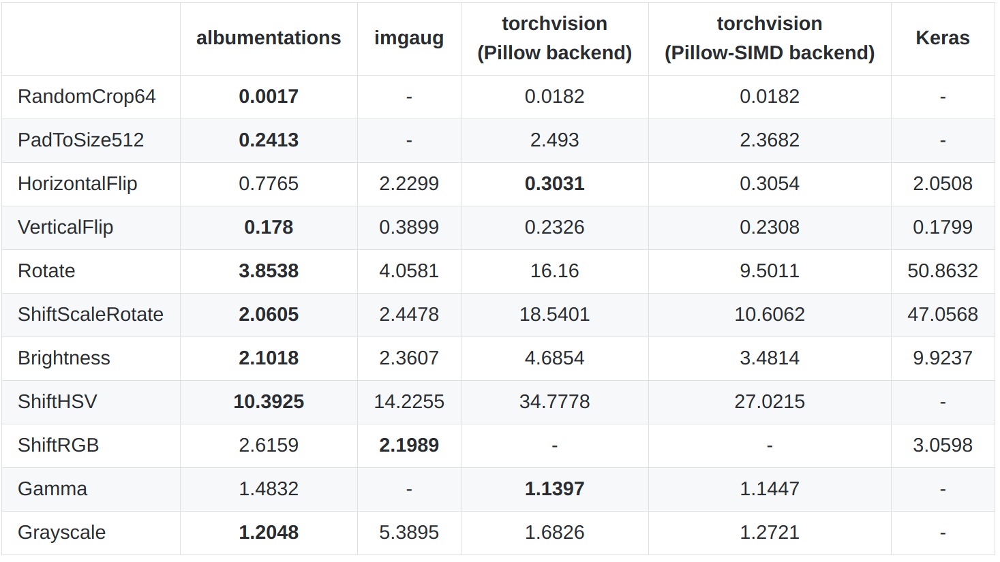
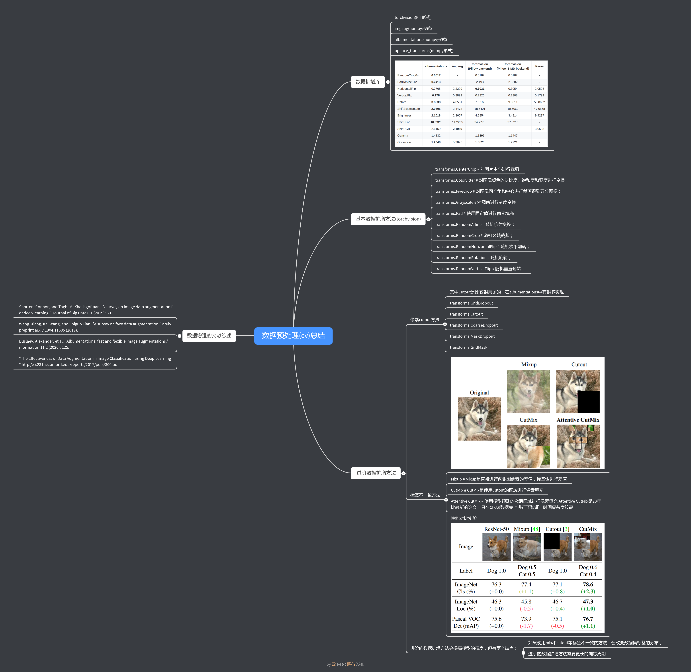

# [data_augmentation](https://www.kaggle.com/c/tgs-salt-identification-challenge/discussion/66643)

比较不同数据增强库的性能
* [albumentations](https://github.com/albumentations-team/albumentations)
* [imgaug](https://github.com/aleju/imgaug)
* [torchvision](https://github.com/pytorch/vision)
* [Augmentor](https://github.com/mdbloice/Augmentor)
* [solt](https://github.com/MIPT-Oulu/solt)
* [opencv_transforms](https://github.com/jbohnslav/opencv_transforms)
* [PIL](https://github.com/python-pillow/Pillow)




##数据预处理

## 如何区分Pillow 和 Pillow-SIMD
```base
# install Pillow-SIMD library

>>> pip uninstall pillow -y
>>> CC="cc -mavx2" pip install -U --force-reinstall pillow-simd

>>>python -c "from PIL import Image; print(Image.PILLOW_VERSION)"
>>>6.0.0.post0 ##(有.post)表示 Pillow-SIMD版本

```
